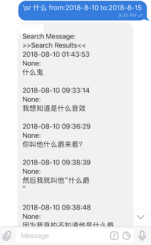

# SearchMessage: A middleware for EFB 

## Notice

**Middleware ID**: `catbaron.search_msg`

**SearchMessage** is a middleware for EFB, to search message from the chat history.

**SearchMessage** 是用来搜索历史消息的中间件.

Usually, you may have trouble to search messages with **Chinses** key words in Telegram clients,
thus here is the middleware could help you out.

由于 Telegram 对中文没有做分词，关键词搜索几乎不可用。所以写了个中间件用来搜索消息。

Be aware that this is a very early develop version. Please let me know if you found any problem.

注意，这是初期版本可能会不稳定。（也可能没有稳定版本了）

You need to use **SearchMessage** on top of [EFB](https://ehforwarderbot.readthedocs.io). Please check the document and install EFB first.

请先装 EFB。

## Dependense

* Python >=3.6
* EFB >=2.0.0
* peewee
* PyYaml
* python-dateutil

## Install

* Install
```
pip install efb-search_msg-middleware
```
* Register to EFB
Following [this document](https://ehforwarderbot.readthedocs.io/en/latest/getting-started.html) to edit the config file. The config file by default is `~/.ehforwarderbot/profiles/default/config.yaml`. It should look like:

装完之后需要在 EFB 的配置文件注册一下中间件。默认在这 `~/.ehforwarderbot/profiles/default/config.yaml`
```
master_channel: foo.demo_master
slave_channels:
- foo.demo_slave
- bar.dummy
middlewares:
- foo.other_middlewares
- catbaron.search_msg
```

You only need to add the last line to your config file.

基本上只要加上最后一行就够了。

* Config the middleware

这个中间件提供了一些选项。第一个基本上不用改。第二个是每次展示的搜索结果数量。改成 0 是没有限制。

The config file by default is `$HOME/.ehforwarderbot/profiles/default/catbaron.search_msg/config.yaml`.
Please create the config file if thers is not one.  Edit it as:

```
# The name of master channel
master: 'blueset.telegram'

# The max number of message the middleware would show you. 
# Set it to 0 for no limitation.
max_num: 15
```

* Restart EFB.



## How to use
### The command: 
`\sr [key_word] [from:datetime] [to:datetime]`
* `key_word`: text without whitespace characters
* `datetime`: Datetime string, such as `1989-6`, `2008-8-8 12:0`. Note that `from:` and `to:` are necessary and there should be no space in this argument. Messages of last 15 days will be searched by default.
* `key_word`: 搜索用的关键字
* `datetime`: 表示时间的字符串， 比如 `1989-6`, 或者 `2008-8-8 12:0`. `from:` 和 `to:` 表示搜索的时间范围。注意所有参数内部都不要有空白字符。


### Usage
1. Sent command to a chat （直接发命令）
   * There should be at least one of the three arguments
   * 三个参数至少要有一个
2. Reply the command to an message （回复一条消息）
   * Search message sent by the author of the replied message
   * 用来搜索某个人发出的消息
   * Some times the author is saved as `None` in the database, so it's not always reliable. 
   * 因为有时候 EFB 会拿不到消息作者的信息，所以这个功能并不总是可靠。（下图里面拿到的就是 None）
3. To locate the message in Telegram, you can: 如果你想在 Telegram 里面定位到某条消息，你可以在用关键字搜索到消息内容只后：
   * Search the full message in Telegram
   * 搜索消息全文
   * Search some segment of message splitted by non-chinese characters.
   * 搜索被符号隔开的部分
   * For instance, say you have a message `这是一条被空格分开  的消息`, to locate this message, you coulde search the entire message, `这是一条被空格分开` or `的消息` in Telegram.
   * 比如你找到这条消息 `这是一条被空格分开  的消息`, 你可以再 Telegram 里面搜索整条消息多全文，或者搜索 `这是一条被空格分开` 或者 `的消息`.
